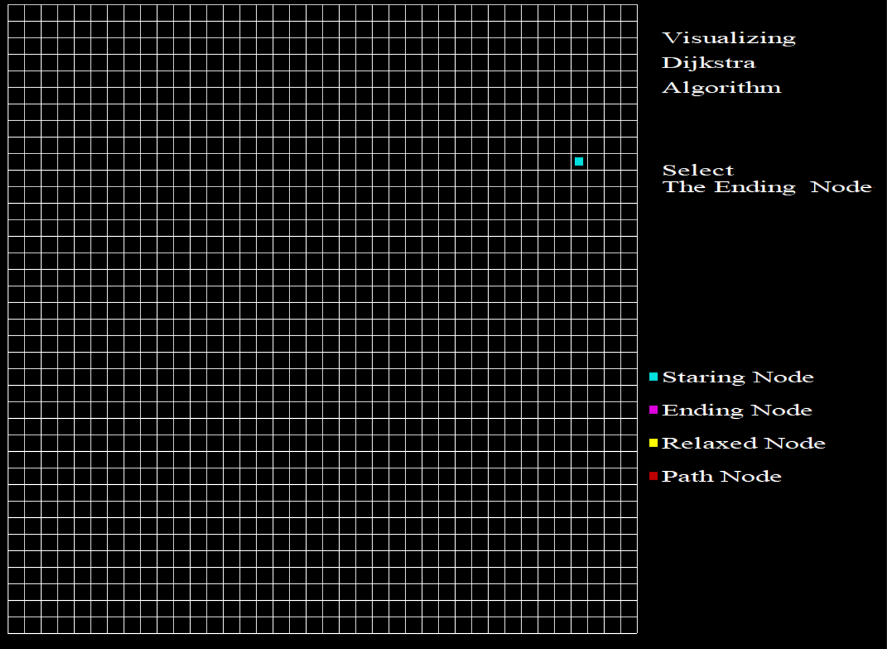
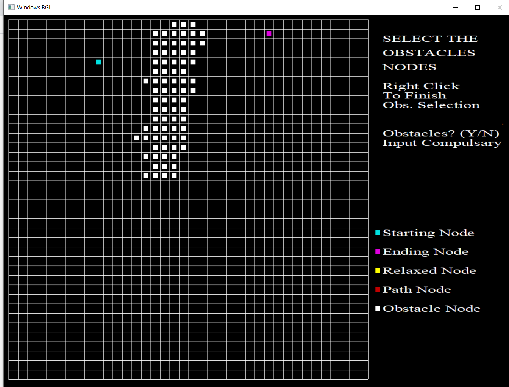
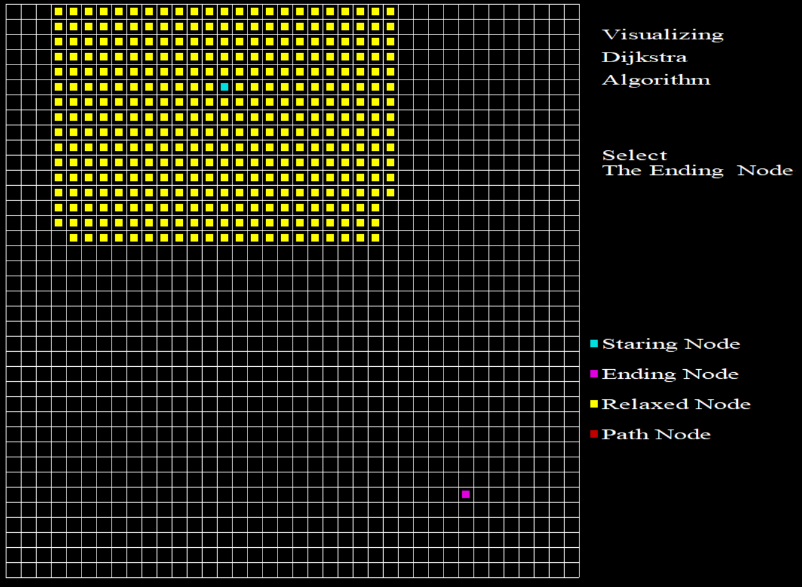
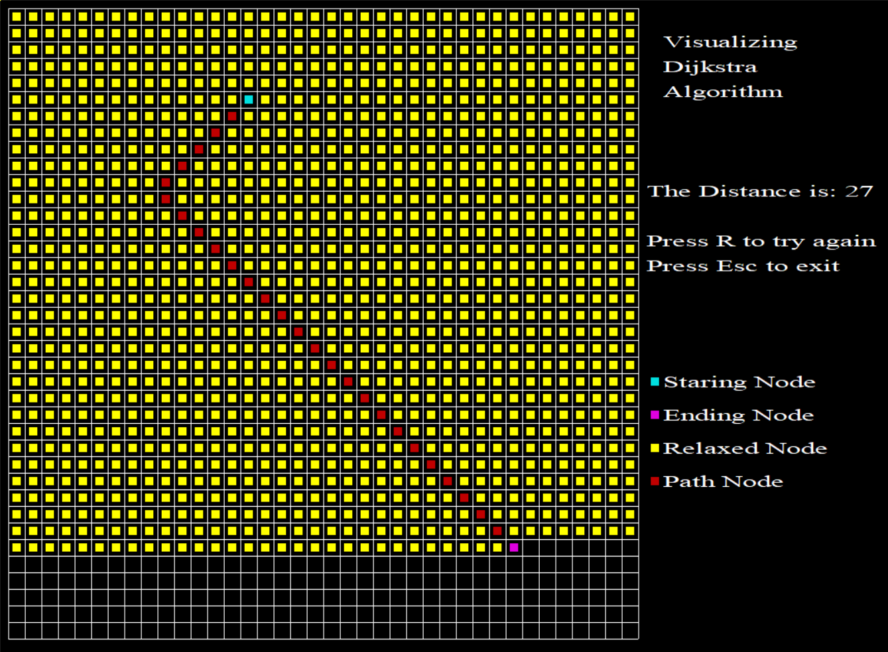
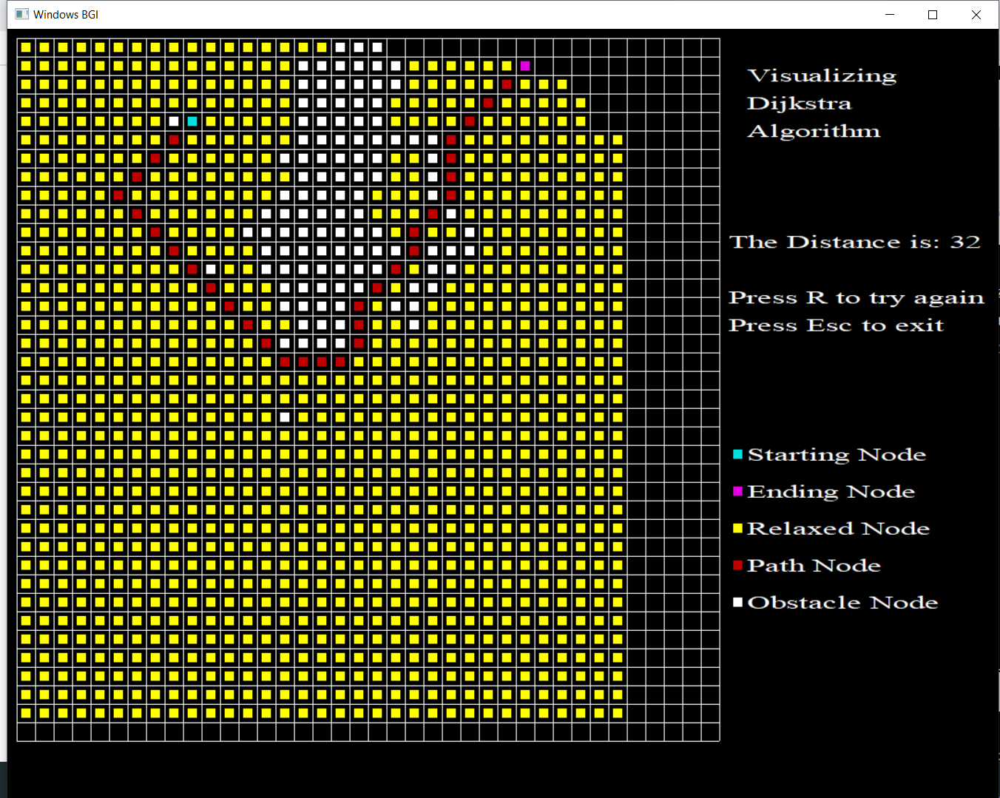

# Dijkstra_Visualization_CPP

#Download the Graphs.exe file and try it in your own system.
#Caution just don't try to the application window to full screen.
If any issues found contact me on "bhan.yash57@gmail.com"
#Inputs will be appretiated

Welcome to Dijkstra Visualizer! I built this application because I was fascinated the way Dijkstra works, and just wanted to visulize this in C++
using the old school graphics library. 
I have tried to bring the theoretical concept into a visualization application, and has shown the basic idea behind the Dijkstra Algorithm.

Dijkstra's Algorithm (weighted): the father of pathfinding algorithms; guarantees the shortest path

See the working on Youtube :-  https://www.youtube.com/watch?v=PVW8IHZruAw

Repo Link: https://github.com/Stiffler-bhan/Dijkstra_Visualization_CPP

<h3>First Screen of the Application where you select the Starting and ending node.

<h3>Then you can add the obstacles in the graph if you want, then the algo would get you the best way possible jumoing the obstacles.
 
 
 
<h3> After that Dijkstra Algorithm starts it's work, of relaxing adjacent nodes one after the other.
  

<h3> In the Final Step it determine the shortest path reaching here both the examples mentioned below with and without the obstacles.

  

